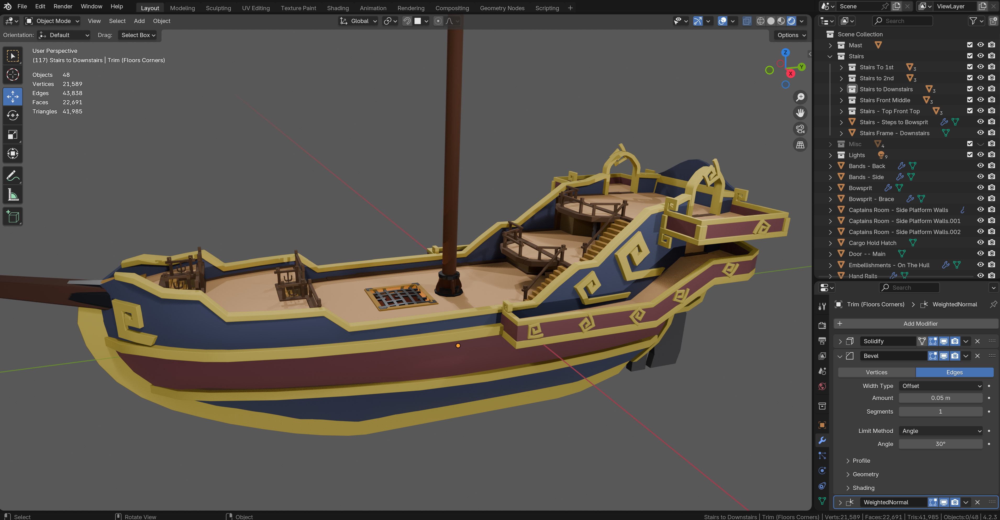
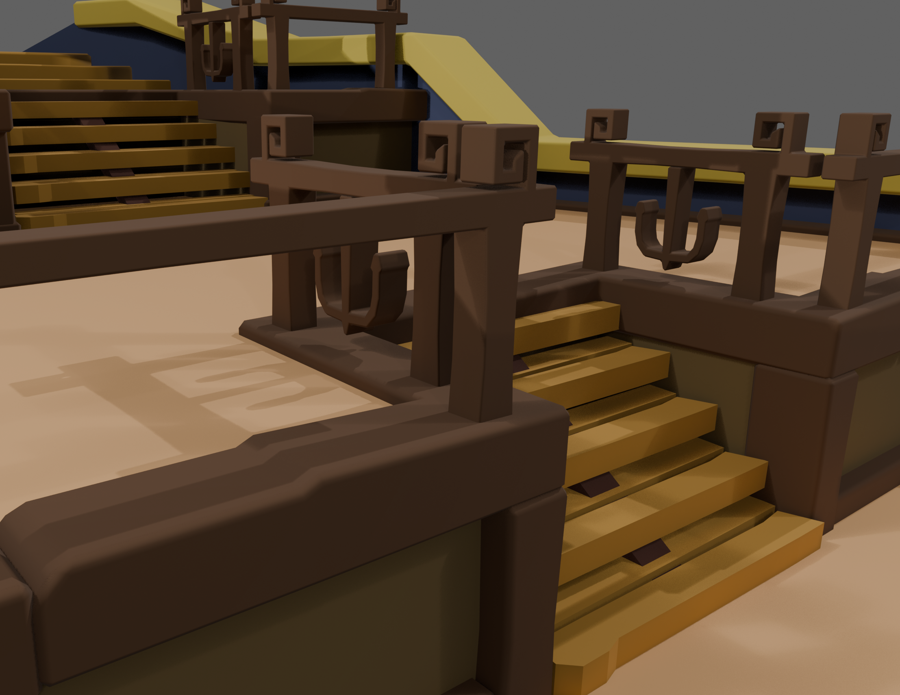

# Pirate Ship Series - Part 2

<b>Hello!</b>

If you're following along with the video series, you'll want to grab the blender `.blend` file. This contains the starting point _(for the start of the Part 2 video)_.

During this second part of the series, we'll build several key points on the ship that we would need for our hypothetical RPG game.

## Normal Map

I have also included a Normal Map (image) in this folder. We'll need that during the video to add the fake wood planks on the hull and floor. But you're welcome to create your own tileable/seamless texture for that.

<b>The blender (starting point) scene looks like this:</b>

Thanks!
-- Galleon Game Dev
